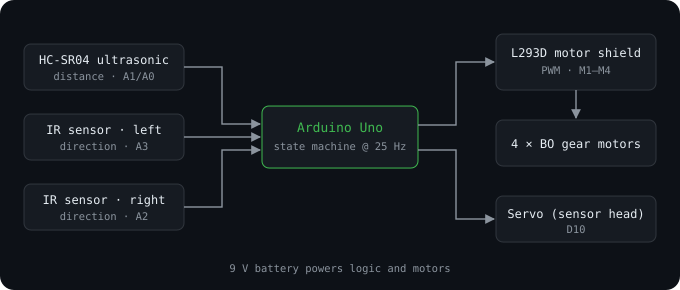
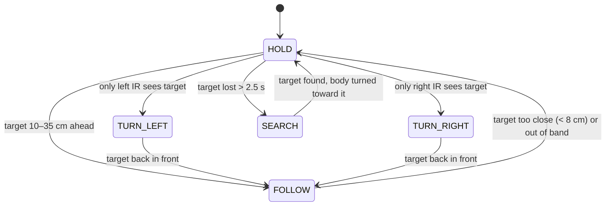

# Human Following Robot

**A four-wheel robot that detects a person in front of it and follows them, built on an Arduino Uno with ultrasonic and infrared sensing.**


<p align="center"></p>

---

## Contents

- [Overview](#overview)
- [Patent and publication](#patent-and-publication)
- [How it works](#how-it-works)
- [Hardware](#hardware)
- [Wiring](#wiring)
- [Getting started](#getting-started)
- [Calibration](#calibration)
- [Repository layout](#repository-layout)
- [Applications and future work](#applications-and-future-work)
- [Team](#team)

## Overview

The robot keeps a person within a comfortable following distance and turns to stay with them as they move. An **HC-SR04 ultrasonic sensor** measures how far away the person is, and **two IR sensors** on the left and right show which way they moved. An **Arduino Uno** runs a small state machine that drives four BO gear motors through an **L293D motor shield**.

Key features:

- **Distance-band following:** drives forward only while the target is between 10 and 35 cm, and stops if someone gets closer than 8 cm.
- **Direction tracking:** pivots left or right when only one IR sensor sees the target.
- **Search mode:** if the target is lost for 2.5 s, the servo-mounted sensor sweeps left and right, and the robot turns toward the closest person it finds.
- **Smooth motion:** motor speeds are ramped on each control tick, so starts and stops don't jerk.
- **Robust sensing:** a median of three ultrasonic pings rejects stray echoes.
- **Tunable:** every pin, distance, speed and timing value lives in [`config.h`](firmware/human_following_robot/config.h).
- **Debug output:** sensor readings and the current state stream over Serial at 115200 baud.

## Patent and publication

| | |
|---|---|
| **Title** | Human Following Robot Using Arduino Uno |
| **Application No.** | 202341080347 A (India) |
| **Filed** | 27 November 2023 |
| **Published** | 22 December 2023, *The Patent Office Journal* No. 51/2023, p. 91906 |
| **Applicant** | R.M.K. Engineering College, Chennai |

The published abstract describes a robot that adds tracking and following to basic detection: it tracks a target and follows the person based on that detection. The following algorithm was tested under different conditions to find and fix errors, and the integrated sensors make tracking more reliable.

## How it works

The control loop runs at **25 Hz**. On each tick it reads the sensors, decides on a state, and drives the motors:



| State | Condition | Motors |
|---|---|---|
| `FOLLOW` | Ultrasonic distance inside the follow band | Both sides forward |
| `TURN_LEFT` | Only the left IR sensor detects the target | Pivot left |
| `TURN_RIGHT` | Only the right IR sensor detects the target | Pivot right |
| `HOLD` | Target too close, or lost only briefly | Stop |
| `SEARCH` | No target for `LOST_TIMEOUT_MS` | Stop, sweep the servo head, then turn toward the closest target |

Safety takes priority: if the person is closer than `DIST_TOO_CLOSE`, the robot always stops, whatever the IR sensors report.

## Hardware

| Component | Qty | Notes |
|---|---|---|
| Arduino Uno | 1 | Main controller |
| L293D motor driver shield (Adafruit v1 compatible) | 1 | Drives four DC motors and one servo |
| BO gear motors + wheels | 4 | Four-wheel drive |
| HC-SR04 ultrasonic sensor | 1 | Distance to the person |
| IR obstacle sensors (FC-51 / TCRT5000 type) | 2 | Left and right direction |
| SG90 servo motor + ultrasonic holder | 1 | Sensor "head" for search sweeps |
| Chassis | 1 | |
| 9 V battery + on/off switch | 1 | Power |
| Jumper and hook-up wires | — | |

## Wiring

The motor shield plugs directly onto the Uno and uses D3–D8, D11 and D12 internally. The sensors connect to the analog header, which the shield breaks out.

| Signal | Arduino pin | Connects to |
|---|---|---|
| Ultrasonic TRIG | `A1` | HC-SR04 `Trig` |
| Ultrasonic ECHO | `A0` | HC-SR04 `Echo` |
| IR right | `A2` | Right IR module `OUT` |
| IR left | `A3` | Left IR module `OUT` |
| Servo | `D10` | Shield `SERVO_1` header |
| Front-left motor | `M1` | Shield motor terminal |
| Front-right motor | `M2` | Shield motor terminal |
| Rear-right motor | `M3` | Shield motor terminal |
| Rear-left motor | `M4` | Shield motor terminal |
| Sensor power | `5V` / `GND` | All sensor `VCC` / `GND` |

> If a wheel spins backwards, swap the two wires of that motor on the shield terminal.

## Getting started

1. Install the **[Arduino IDE](https://www.arduino.cc/en/software)**.
2. Open **Tools → Manage Libraries…** and install **Adafruit Motor Shield library** (the v1 library, which provides `AFMotor.h`). `Servo` ships with the IDE.
3. Open `firmware/human_following_robot/human_following_robot.ino`. The IDE opens `config.h` as a second tab.
4. Select **Tools → Board → Arduino Uno** and the correct port, then click **Upload**.
5. Open **Tools → Serial Monitor** at **115200 baud** to watch distance, IR readings and the current state.

When it powers on, the robot looks left, then right, then centres its sensor head before it starts following.

## Calibration

All tuning is in [`config.h`](firmware/human_following_robot/config.h):

| Setting | Default | What it does |
|---|---|---|
| `DIST_FOLLOW_MIN` / `DIST_FOLLOW_MAX` | 10 / 35 cm | Distance band in which the robot drives forward |
| `DIST_TOO_CLOSE` | 8 cm | Hard stop distance |
| `SPEED_FORWARD` / `SPEED_TURN` | 170 / 190 | Motor PWM (0–255) |
| `SPEED_RAMP` | 12 | Maximum PWM change per tick; lower is smoother |
| `LOST_TIMEOUT_MS` | 2500 | How long before search mode starts |
| `IR_ACTIVE_LOW` | `true` | Set to `false` if your IR modules output HIGH on detection |

Tips:

- Adjust each IR module's potentiometer so it triggers at roughly the same distance as `DIST_FOLLOW_MAX`.
- For reliable tracking, the target should stand out from the surroundings, and the IR sensors should not face strong sunlight.
- If the robot turns too far or not far enough, lower or raise `SPEED_TURN`.

## Repository layout

```
human-following-robot/
├── firmware/
│   └── human_following_robot/
│       ├── human_following_robot.ino   # control loop, sensing, state machine
│       └── config.h                    # pins and tuning values
├── docs/
│   └── system-diagram.svg
└── README.md
```

## Applications and future work

**Applications:** a companion that carries loads in hospitals, libraries and airports; an assistant in shopping centres and crowded public spaces; support for elderly people and children; and, with changes to its logic, following a designated vehicle.

**Future work:**

- Wireless control for long-range remote operation
- A live camera for real-time monitoring
- Camera-based person tracking, so it depends less on IR contrast
- Luggage-carrier mode for malls and airports

## Team

Developed at **R.M.K. Engineering College**, Chennai.

**Inventors (Patent Application 202341080347 A):** K. Udhayan, B. Sri Madhava, **T. Vishnu Varthan**, A. Syed Ibrahim, A. Tharun, T. Charan, Dr. P. S. Latha Mageshwari, Dr. S. Radhika, Dr. S. Pavai Madheswari.

Maintained by **[Vishnu Varthan Thiagarajan](https://vishnuvarthan.vercel.app)**, [LinkedIn](https://www.linkedin.com/in/vishnu-varthan-thiagarajan-3a40a2438/).

---

<sub>This repository is a clean, documented rewrite of the robot's firmware, based on the design described in the patent application and project documentation.</sub>
